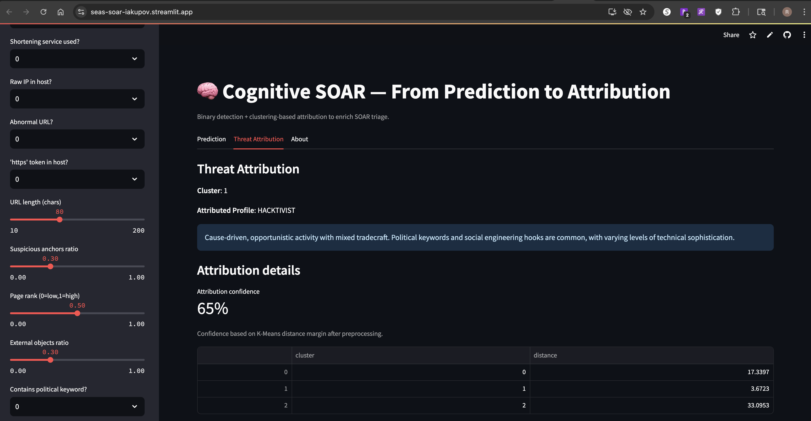

# Cognitive SOAR — From Prediction to Attribution

Enhances a Mini-SOAR demo by adding **threat attribution** via **unsupervised clustering**.

- **Classification** (PyCaret): MALICIOUS vs BENIGN.
- **Clustering** (PyCaret): Map malicious samples to **STATE_SPONSORED**, **ORG_CRIME**, or **HACKTIVIST**.

---

## 🚀 Live Demo
👉 Public Streamlit app: [seas-soar-iakupov.streamlit.app](https://seas-soar-iakupov.streamlit.app/)


---

## ⚡ Quickstart (local)

```bash
python -m venv .venv && source .venv/bin/activate
pip install -r requirements.txt
streamlit run app/app.py
```

## 🧩 Architecture
```
[User Features] --> [Classifier] --BENIGN--> [Stop]
                               \-MALICIOUS-> [Clustering] -> [Profile Mapping] -> [Attribution]
```
Artifacts saved in artifacts/:
	•	phishing_url_detector.pkl
	•	threat_actor_profiler.pkl
	•	cluster_profile_map.json (maps discovered cluster → actor profile)

 
